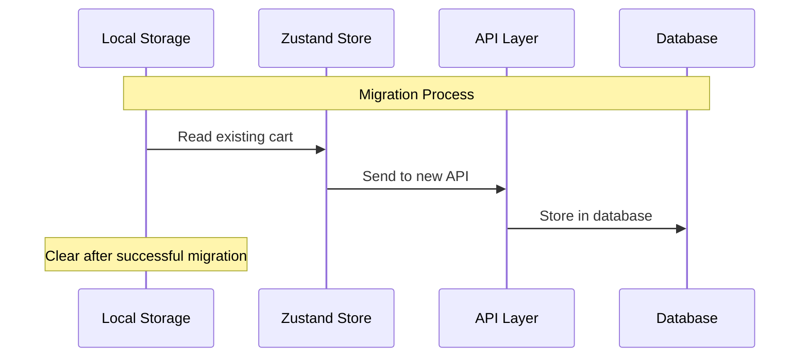
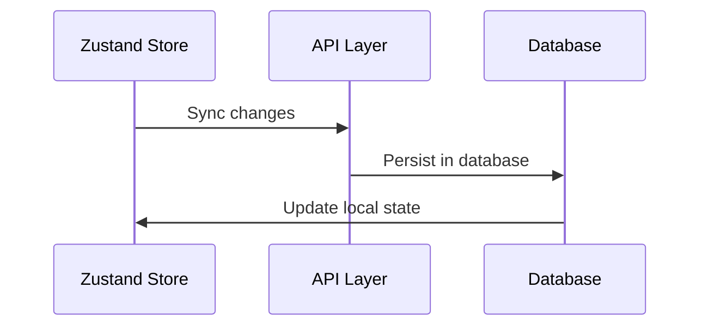

# Cart Implementation Plan

## 1. Database Schema

We'll add two new models to store cart data:

```prisma
model Cart {
  id        String     @id @default(cuid())
  userId    String     @map("user_id")
  user      User       @relation(fields: [userId], references: [id], onDelete: Cascade)
  items     CartItem[]
  createdAt DateTime   @default(now()) @map("created_at")
  updatedAt DateTime   @updatedAt @map("updated_at")

  @@map("carts")
}

model CartItem {
  id        String  @id @default(cuid())
  cartId    String  @map("cart_id")
  cart      Cart    @relation(fields: [cartId], references: [id], onDelete: Cascade)
  productId String  @map("product_id")
  product   Product @relation(fields: [productId], references: [id])
  quantity  Int
  price     Decimal

  @@map("cart_items")
}
```

## 2. API Structure

```
/src/app/api/cart/
├── route.ts (GET, POST - manage cart)
├── [cartId]/
│   └── route.ts (PUT, DELETE - update/delete cart)
└── items/
    ├── route.ts (GET, POST - manage items)
    └── [itemId]/
        └── route.ts (PUT, DELETE - update/delete items)
```

## 3. Dashboard Components

```
/src/app/(protected)/dashboard/
├── cart/
│   ├── page.tsx (Cart list page)
│   └── components/
│       ├── cart-table.tsx (Display carts in table format)
│       ├── cart-item-list.tsx (Display items in a cart)
│       └── cart-actions.tsx (Actions like clear cart, move to order)
```

## 4. Features

### Cart Management

- View all carts in dashboard
- See cart items and total
- Clear cart functionality
- Convert cart to order
- Track cart creation/update dates

### Cart Items Management

- Add/remove items
- Update quantities
- Show product details
- Calculate totals

## 5. Migration Process

1. Read existing cart from localStorage
2. Send to new API endpoints
3. Store in database
4. Clear localStorage after successful migration
5. Update Zustand store to use new API

## 6. Security Considerations

- Cart access restricted to cart owner
- Server-side validation of:
  - Product availability
  - Price accuracy
  - Quantity limits
- Rate limiting for cart operations
- Proper error handling and validation

## 7. State Management

### Local Storage to Database Migration



### New Cart Flow


